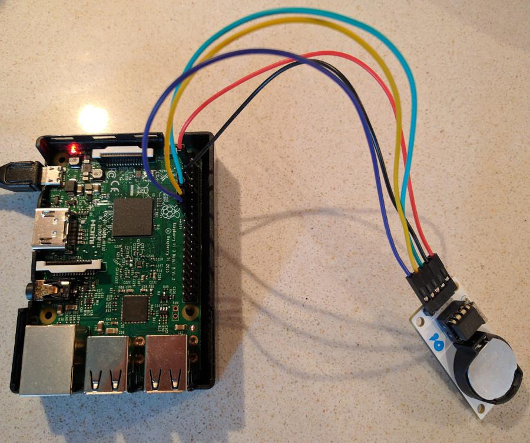

# rpi.rtc
Simple Python module to deal with DS1302 RTC on Raspberry Pi



```python
# Connection as on an image above:
import pyRPiRTC
pyRPiRTC.DS1302(ce_pin=15, data_pin=13, clk_pin=11)
```


### Wire map (default conf.)

| Chip        | Rpi pin       |
| ----------- |:-------------:|
| VCC         | 3.3v pin      |
| GND         | GND pin       |
| CE (RST)    | pin 11        |
| DATA        | pin 12        |
| CLK         | pin 13        |


### Setup

```bash
git clone https://github.com/surik00/rpi.rtc.git
cd rpi.rtc
sudo python3 setup.py install
```


### Simple use

```python
from datetime import datetime, timezone
import pyRPiRTC


def format_dt(dt):
    return dt.strftime('%Y.%m.%d %H:%M:%S')


def utc_to_local(utc_dt):
    return utc_dt.replace(tzinfo=timezone.utc).astimezone(tz=None)


rtc = pyRPiRTC.DS1302()
# rtc = pyRPiRTC.DS1302(ce_pin=11, data_pin=12, clk_pin=13)  # setup custom GPIO ports

# dt_now = datetime.now()  # datetime WITH timezone info
dt_now = datetime.utcnow()  # datetime without timezone info
print('Now is (UTC)', format_dt(dt_now))
# Now is (UTC) 2018.06.09 13:29:03

rtc.write_datetime(dt_now)

dt_rtc = rtc.read_datetime()
print('RTC time is:', format_dt(dt_rtc))
# RTC time is: 2018.06.09 13:29:03
print('With applied timezone info current time is:', format_dt(utc_to_local(dt_rtc)))
# With applied timezone info now is: 2018.06.09 16:29:03

```


### Read RTC chip date and time

    ds1302_get_utc


### RPi date and time (UTC) to RTC chip

    ds1302_set_utc


### Update Rpi system time from RTC chip

Typically call at RPi startup

    sudo date -s `./ds1302_get_utc`


### One line to check RTC chip time vs system time

Since RTC store only second and not millisecond a 1s delta can occur (or more after a few days)

    # drift in second
    echo $(($(date -u -d`ds1302_get_utc` +%s) - $(date -u +%s)))
    # human readable
    echo "RTC `ds1302_get_utc`"; echo "SYS `date --utc +%FT%TZ`";
